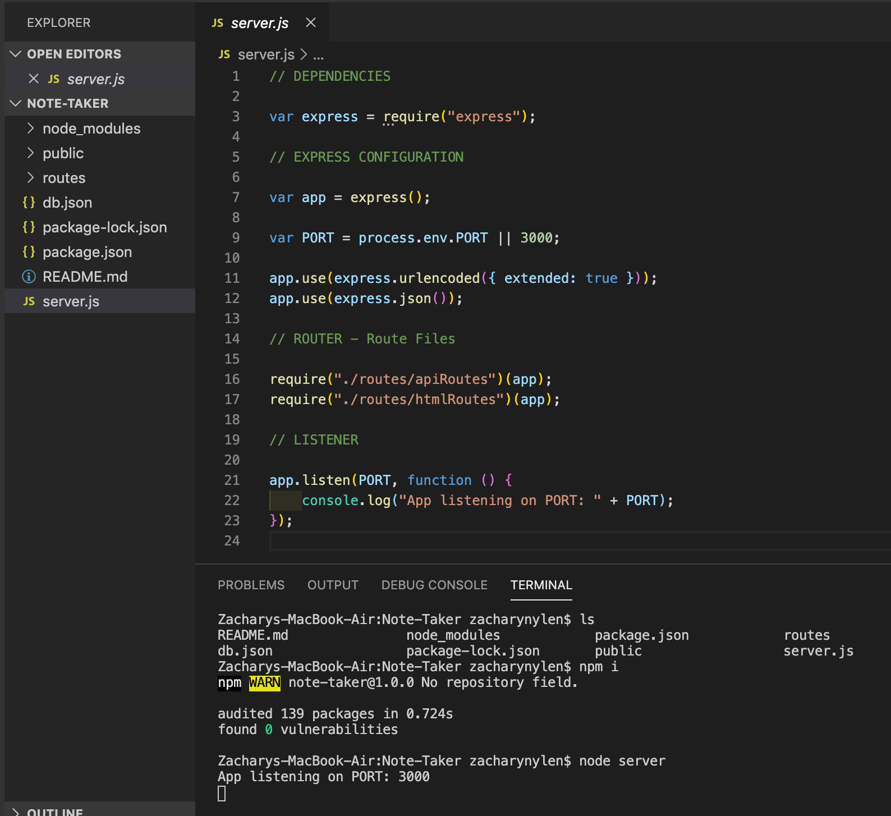
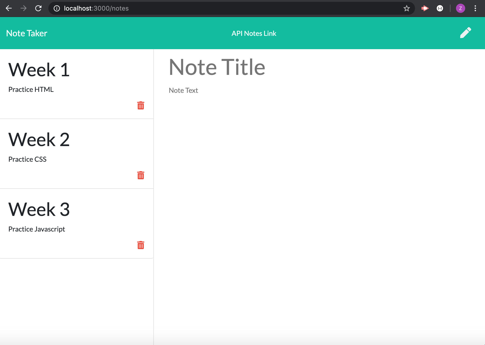
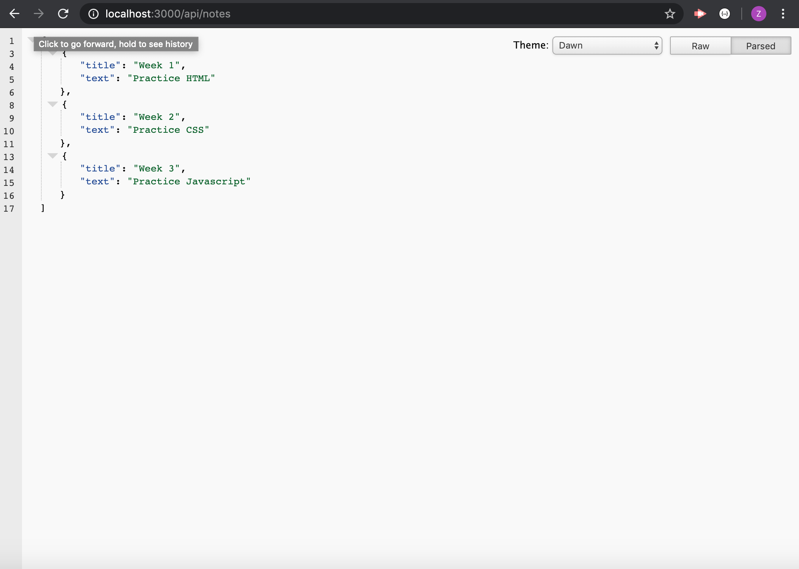

# Note-Taker
Application that can be used to write, save, and delete notes.

## Description
This project was created using newly learned material related to creating servers and express.js. It also used the methods of GET, POST, and DELETE to render, save, and delete notes in an html file. This application uses an express backend and saves and retrieves note data from a JSON file. 

## Usage
1. Open the server.js file, open the terminal and "cd" into the correct directory.

2. Once inside the correct directory, install the required NPM installations using "npm i".

3. Invoke the following command within the terminal to get the app to run (node server).

4. The terminal will render the following command (App listening on PORT: 3000).

5. Open the web browser and type in (localhost: 3000), this will take you to the home page of the Note Taker App.

6. Click "get started" from the homepage which will take you to a page where you can add note data.

7. Enter title and text data into the input fields and click the save icon. This will save the data to a db.json file and also render the data on the current page.

8. Once rendered, a delete icon will also be created next to the rendered data. To delete a note, simply click this icon on the note you wish to remove. This action will remove the data from the html page as well as the db.json file.

9. If you wish to see data stored within the db.json file, simply click the "API Notes Link" at the top of the page.

## Below is a screenshot how terminal should look when you spin up your server (Listening on port 3000):

 

## Below is a screenshot of saved Notes in HTML:

 
 
## Below is a screenshot of updated db.json file with newly saved data:

 

